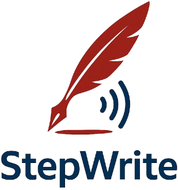
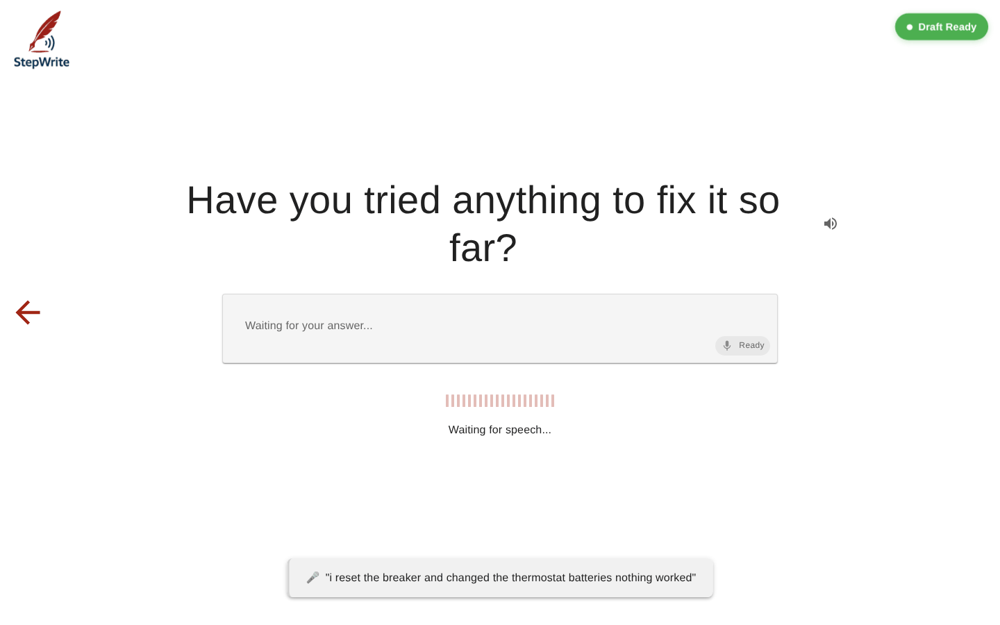
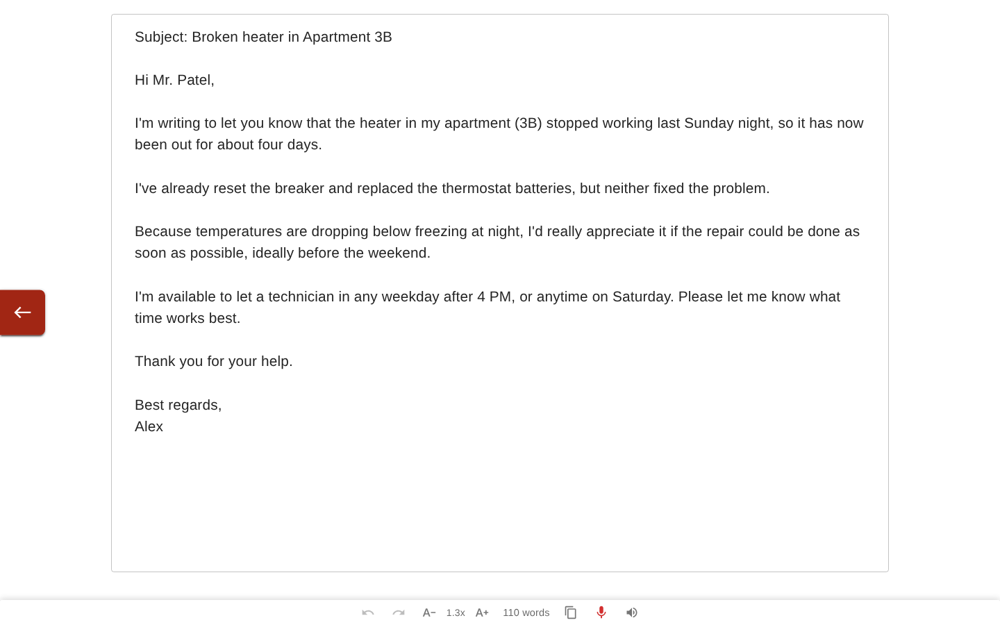
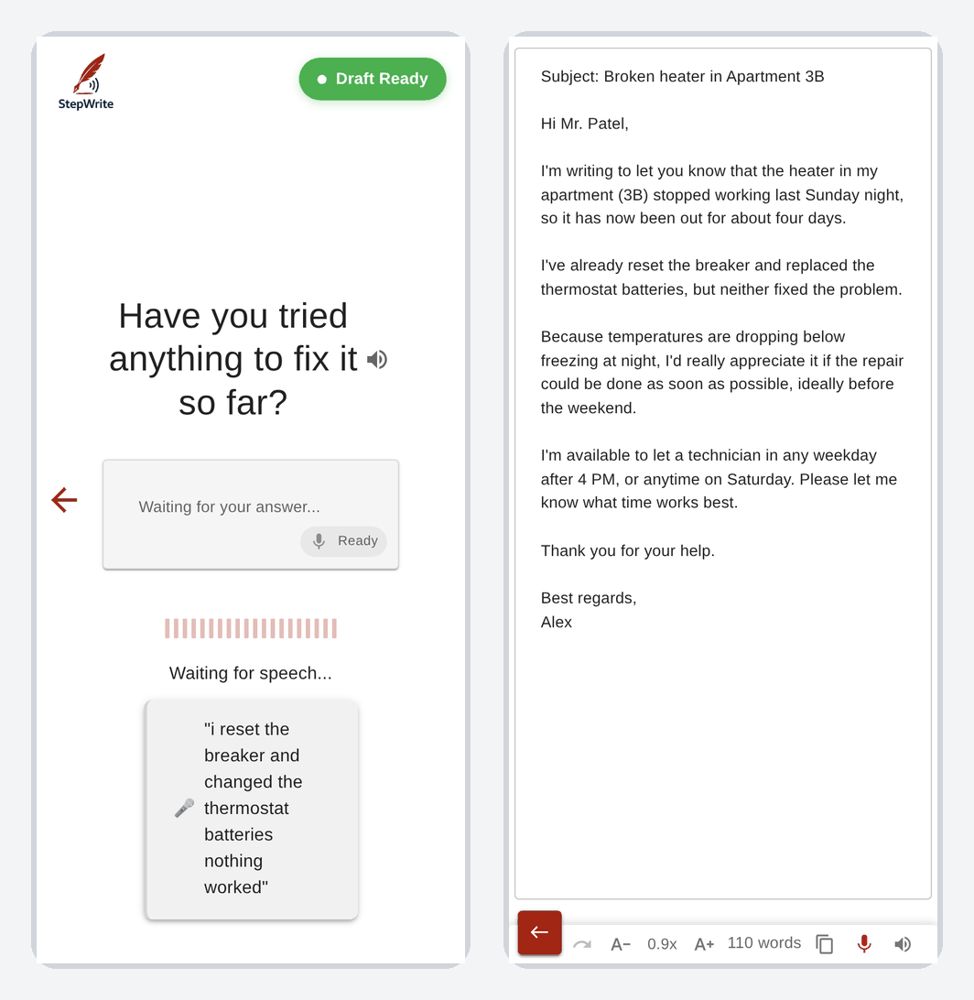
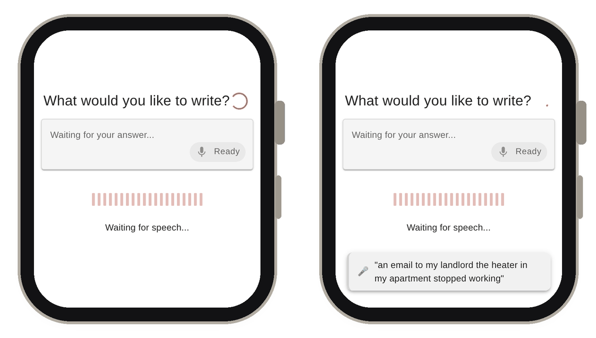

<p align="center">
  
</p>

<h1 align="center">StepWrite</h1>

<p align="center">
  Adaptive planning for speech-driven text generation.<br />
  Compose emails, messages and other longer-form text by voice, hands-free and eyes-free, one question at a time.
</p>

<p align="center">
  <a href="https://doi.org/10.1145/3746059.3747610"></a>
  <a href="https://doi.org/10.1145/3746059.3747610"></a>
  <a href="https://arxiv.org/abs/2508.04011"></a>
  <a href="https://www.cs.cmu.edu/~helalaou/publications/stepwrite/"></a>
  
  
</p>

<p align="center">
  
</p>

This repository contains the research prototype for the UIST '25 paper
**[StepWrite: Adaptive Planning for Speech-Driven Text Generation](https://doi.org/10.1145/3746059.3747610)**
by Hamza El Alaoui, Atieh Taheri, Yi-Hao Peng and Jeffrey P. Bigham.

[Paper (ACM DL)](https://doi.org/10.1145/3746059.3747610) ·
[arXiv](https://arxiv.org/abs/2508.04011) ·
[Project page](https://www.cs.cmu.edu/~helalaou/publications/stepwrite/) ·
[Citation](#citation)

## Overview

Dictation works well for short replies, but composing a longer, structured piece of text by voice
while walking, commuting or otherwise on the move is hard: you have to plan the whole message in
your head, hold it in memory while you speak, and you cannot look at a screen to revise it.

StepWrite is an LLM-driven, voice-based system that enables structured, hands-free and eyes-free
composition of longer-form text. Instead of asking the user to dictate a finished message, it
takes on the planning: it asks one short, context-aware question at a time, reads each question
aloud, and listens for the spoken answer. Each new question is chosen based on everything said so
far, so the conversation adapts to the task. When it has enough information, StepWrite writes the
full text, checks it against what the user actually said, and reads it back. Users can go back and
change an earlier answer at any point; StepWrite works out which later questions depend on that
answer and discards only those, keeping the rest of the conversation.

## How it works

<p align="center">
  
</p>

1. **Choose a task.** *Start New* writes a text from scratch. *Reply* composes a response to a
   text you received (the prototype uses a sample email defined in
   [`client/src/config.js`](client/src/config.js) as `core.reply_email`).
2. **Answer step-by-step questions.** The server asks the model for the single best next question
   given the conversation so far, along with a decision on whether more information is needed. The
   client speaks the question with text-to-speech, detects speech in the browser with voice
   activity detection, filters noise and sends the audio for transcription.
3. **Background drafts.** Once at least three questions are answered, a draft is generated in the
   background after each answer, and a **Draft ready** indicator appears. Saying "show draft" opens
   the latest draft in the editor.
4. **Final text with fact-checking.** When no follow-up is needed (or the user says "finish
   writing"), the server classifies the intended tone, generates the text, and runs a fact-check
   loop that compares the output to the user's answers and corrects discrepancies (up to five
   attempts).
5. **Review and revise.** The editor reads the text aloud when it opens and supports editing, undo/redo, font
   size, a one-sentence-per-line view and copy to clipboard. Saying "go back to questions" returns
   to the conversation, where any answer can be changed.

<p align="center">
  
</p>

### Voice commands

In hands-free mode everything can be done by voice. Phrases are matched fuzzily (configurable),
and each command has many variants in [`client/src/config.js`](client/src/config.js)
(`handsFree.commands`). Examples:

| Where     | Command                                   | Effect                                                        |
| --------- | ----------------------------------------- | ------------------------------------------------------------- |
| Questions | "skip this question"                      | Skip the current question                                     |
| Questions | "next question" / "previous question"     | Move between answered questions                               |
| Questions | "change my answer"                        | Re-answer a question; only dependent later questions are discarded |
| Questions | "show draft"                              | Open the latest draft in the editor                           |
| Questions | "pause writing" / "continue writing"      | Pause and resume listening                                    |
| Questions | "finish writing"                          | Stop asking questions and generate the final text            |
| Questions | "go to home page"                         | Return to the home screen                                     |
| Editor    | "go back to questions"                    | Return to the question flow                                   |
| Editor    | "read it again" / "stop reading"          | Replay or stop the spoken text                                |

### Mobile and smartwatch

The interface is responsive and works in a phone browser (for example over an
[ngrok HTTPS tunnel](#remote-access-with-ngrok)).

<p align="center">
  
</p>

StepWrite also works in a smartwatch browser. On watch-sized screens the interface switches to a
compact layout, and because the whole flow is driven by voice, a text can be composed entirely from
the wrist.

<p align="center">
  
</p>

## Architecture

```
Browser (React 18, Create React App, MUI)
 ├─ Voice activity detection: @ricky0123/vad-web + onnxruntime-web (loaded from jsDelivr in index.html)
 ├─ Pre-VAD noise filtering and silence checks (client/src/utils/audioUtils.js)
 ├─ Hands-free, text-only or text-and-voice input (REACT_APP_INPUT_MODE)
 └─ HTTP → Node.js server on :3001
      ├─ POST /api/write                         next question, background draft, or final text
      │                                          (Start New and Reply; Reply sends the received text as context)
      ├─ POST /api/reply, /api/edit              standalone reply and edit endpoints
      ├─ POST /api/generate-initial-reply-question
      ├─ POST /api/classify/tone, /api/classify/text-type, /api/fact-check
      ├─ POST /api/draft/current, /api/control/followup
      ├─ POST /api/transcribe                    speech-to-text (OpenAI whisper-1)
      ├─ POST /api/tts/generate, GET /tts/*      text-to-speech (OpenAI tts-1), cached on disk
      └─ POST /api/save-experiment-data          study logging (see below)
```

The server ([`server/server.js`](server/server.js), [`server/openaiModule.js`](server/openaiModule.js))
keeps no conversation state: the client sends the full *conversation planning* object (the list
of questions and answers plus a `followup_needed` flag) with every request.

All model behaviour is defined by the prompts in [`server/prompts/`](server/prompts):

| Prompt                          | Purpose                                                                             |
| ------------------------------- | ----------------------------------------------------------------------------------- |
| `writePrompts.js`               | Choose the next question for a new text, and write the final text                   |
| `replyPrompts.js`               | Same for replies, grounded in the received message                                 |
| `editPrompts.js`                | Edit flow (currently disabled in the UI)                                            |
| `toneClassificationPrompt.js`   | Pick one of 14 tones (formal, urgent, empathetic, ...) to guide the final text      |
| `factCheckingPrompt.js`         | Verify the output against the user's answers and generate corrections              |
| `dependencyAnalysisPrompt.js`   | Decide which later questions are affected when an earlier answer changes           |
| `textTypeClassificationPrompt.js` | Classify text as email, letter, message or other                                  |
| `memoryPrompt.js`               | Optional user profile context (disabled by default)                                 |

## Getting started

### Prerequisites

- [Node.js](https://nodejs.org) and npm (a current LTS release)
- An [OpenAI API key](https://platform.openai.com/api-keys)
- A Chromium-based browser or Safari with microphone access. Browsers only allow microphone access
  on `localhost` or over HTTPS.

### 1. Install

```bash
git clone https://github.com/helalaou/StepWrite.git
cd StepWrite
npm run install-all     # installs the root, client and server dependencies
```

### 2. Configure the server

```bash
cp server/.env.template server/.env
```

Then set your key in `server/.env` (see [Configuration](#configuration)).

### 3. Run

```bash
npm start
```

This starts the server on <http://localhost:3001> and the React app on
<http://localhost:3000> together. Alternatively, start them separately with `npm start` in
`server/` and in `client/`, or use `./run.sh`.

Open <http://localhost:3000>, allow microphone access, and choose **Start New** or **Reply**.

## Configuration

### Environment

`server/.env` (copied from [`server/.env.template`](server/.env.template)) is loaded with dotenv
when the server starts from the `server/` directory:

| Variable         | Required | Description                                                         |
| ---------------- | -------- | ------------------------------------------------------------------- |
| `OPENAI_API_KEY` | Yes      | Used for question generation, drafting, speech-to-text and text-to-speech |

The client reads these optional build-time variables (for example in `client/.env`):

| Variable                           | Default                | Description                                                     |
| ---------------------------------- | ---------------------- | --------------------------------------------------------------- |
| `REACT_APP_INPUT_MODE`             | `HANDS_FREE`           | `HANDS_FREE`, `TEXT_ONLY` or `TEXT_AND_VOICE`                   |
| `REACT_APP_TTS_MODE`               | `ENABLED`              | `ENABLED` or `DISABLED` spoken questions and output             |
| `REACT_APP_TEXT_EDITOR_TTS_PREFIX` | `The final output is:` | Phrase spoken before the final text is read aloud               |
| `REACT_APP_COMMAND_MATCHING_MODE`  | `FUZZY`                | Voice command matching: `FUZZY`, `CONTAINS` or `EXACT_MATCH`    |

### Server settings

[`server/config.js`](server/config.js) holds the model, temperature and token limit for every
step (all default to `chatgpt-4o-latest`), the fact-checking loop, tone classification, the
continuous-draft policy, the TTS voice (`nova`) and the Whisper settings. Logs are written to
`server/temp/app.log`.

### Client settings

[`client/src/config.js`](client/src/config.js) holds the API URL and deployment mode, the reply
email used in the Reply flow, voice activity detection and noise thresholds, voice command
phrases, and the continuous-draft display settings. The continuous-draft settings exist in both
config files and should be kept in sync.

### Remote access with ngrok

To use StepWrite from a phone, expose both ports over HTTPS. Set `DEPLOY_MODE = 'ngrok'` and the
`NGROK.SERVER_URL` / `NGROK.CLIENT_URL` values in [`client/src/config.js`](client/src/config.js),
and start tunnels for ports 3000 and 3001 (see [`ngrok_config.yml`](ngrok_config.yml) for the
tunnel layout; use your own ngrok auth token and domain). The server accepts requests from ngrok
origins.

## User study mode

The prototype includes logging for running user studies. It is off by default.

1. Set `experiment.enabled: true` in [`client/src/config.js`](client/src/config.js).
   `experiment.enabled` in [`server/config.js`](server/config.js) must also be `true` (the default).
2. With `participantIdRequired: true`, each session starts by asking for a **participant ID**.
3. During the session the client tracks how often the participant skipped a question or modified
   an answer, and the time spent writing (answering questions) and revising (in the editor).
4. In the editor, an end button (or saying "end writing" or "save and finish", detected with the
   browser's Web Speech API where available, e.g. in Chrome) saves the session.

Each session is saved on the server as `server/temp/experiment_data/<participantId>_<write|reply>_experiment.txt`
and contains the participant ID, skip and modify counts, writing and revision time, every
question and answer, the generated text, and the participant's revised text. The `server/temp/`
directory is git-ignored.

## Project structure

```
├── client/                     React app (Create React App)
│   ├── public/                 index.html (loads the VAD scripts), icons, logo, click sound
│   └── src/
│       ├── components/         LandingPage, HandsFreeInterface, ChatInterface, TextEditor,
│       │                       ParticipantIdInput, ExperimentEndButton, ...
│       ├── hooks/              conversation, chat and editor state
│       ├── utils/              audio filtering and sound helpers
│       └── config.js           client configuration
├── server/                     Express API
│   ├── prompts/                all LLM prompts
│   ├── memory/                 optional user profile context
│   ├── data/                   user_memories.json (used only when memory is enabled)
│   ├── utils/                  logging and temp-file cleanup
│   ├── openaiModule.js         OpenAI calls, fact-checking and dependency analysis
│   ├── server.js               routes
│   ├── config.js               server configuration
│   └── .env.template
├── docs/assets/                screenshots
├── install.sh, run.sh, deploy.sh
└── ngrok_config.yml
```

## Citation

If you use StepWrite in your research, please cite:

```bibtex
@inproceedings{elalaoui2025stepwrite,
  author    = {El Alaoui, Hamza and Taheri, Atieh and Peng, Yi-Hao and Bigham, Jeffrey P.},
  title     = {StepWrite: Adaptive Planning for Speech-Driven Text Generation},
  booktitle = {Proceedings of the 38th Annual ACM Symposium on User Interface Software and Technology},
  series    = {UIST '25},
  year      = {2025},
  publisher = {ACM},
  doi       = {10.1145/3746059.3747610},
  url       = {https://doi.org/10.1145/3746059.3747610}
}
```

> Hamza El Alaoui, Atieh Taheri, Yi-Hao Peng, and Jeffrey P. Bigham. 2025. StepWrite: Adaptive
> Planning for Speech-Driven Text Generation. In *Proceedings of the 38th Annual ACM Symposium on
> User Interface Software and Technology (UIST '25)*. ACM. https://doi.org/10.1145/3746059.3747610

Citation metadata is also available in [`CITATION.cff`](CITATION.cff).

## Contributing

Issues and pull requests are welcome. Read [CONTRIBUTING.md](CONTRIBUTING.md) and follow the
[Code of Conduct](CODE_OF_CONDUCT.md).

## Contact

Hamza El Alaoui, Carnegie Mellon University · helalaou@cs.cmu.edu
